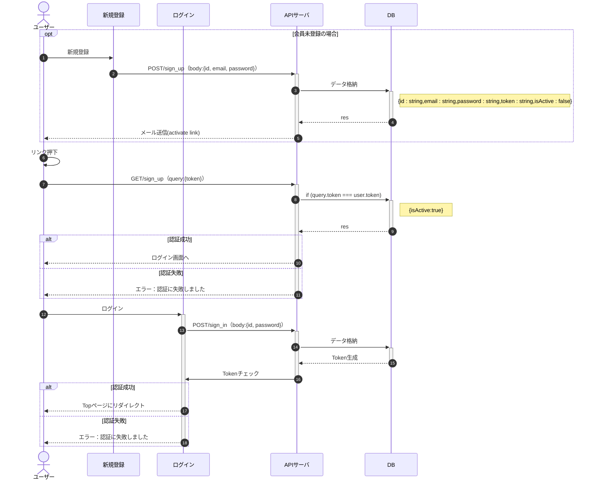

# シーケンス図

```mermaid
sequenceDiagram
actor ユーザー
participant 新規登録
participant ログイン
    autonumber
    opt 会員未登録の場合
      ユーザー->>新規登録: 新規登録
      新規登録->>+APIサーバ:POST/sign_up（body:{id, email, password}）
      APIサーバ->>+DB:データ格納
      Note right of DB: {id : string,email : string,password : string,token : string,isActive : false}
      DB-->>-APIサーバ:res
      APIサーバ-->>-ユーザー:メール送信(activate link)
    end
    ユーザー->>ユーザー:リンク押下
    ユーザー->>+APIサーバ:GET/sign_up（query:{token}）
    APIサーバ->>+DB:if (query.token === user.token)
    Note right of DB: {isActive:true}
    DB-->>-APIサーバ:res
    alt 認証成功
      APIサーバ-->>ユーザー:ログイン画面へ
    else 認証失敗
      APIサーバ-->>-ユーザー:エラー：認証に失敗しました
    end

    ユーザー->>+ログイン:ログイン
    ログイン->>+APIサーバ:POST/sign_in（body:{id, password}）
    APIサーバ->>+DB:データ格納
    DB-->>-APIサーバ:Token生成
    APIサーバ->>-ログイン:Tokenチェック
    alt 認証成功
      ログイン-->>ユーザー:Topページにリダイレクト
    else 認証失敗
      ログイン-->>-ユーザー:エラー：認証に失敗しました
    end
```
