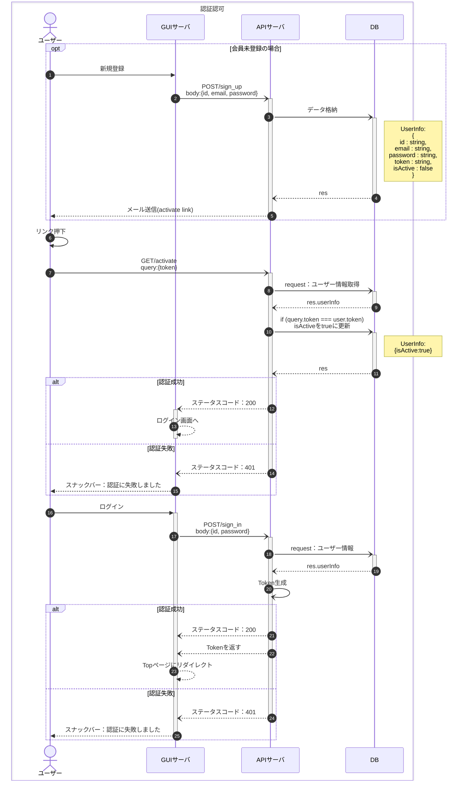

# シーケンス図

```mermaid
sequenceDiagram
box 認証認可
actor ユーザー
participant GUIサーバ
participant APIサーバ
participant DB
end
    autonumber
    opt 会員未登録の場合
      ユーザー->>GUIサーバ: 新規登録
      GUIサーバ-)+APIサーバ: POST/sign_up<br>body:{id, email, password}
      APIサーバ-)+DB: データ格納
      Note right of DB: UserInfo:<br>{<br>id : string,<br>email : string,<br>password : string,<br>token : string,<br>isActive : false<br>}
      DB--)-APIサーバ: res
      APIサーバ-->>-ユーザー: メール送信(activate link)
    end
    ユーザー->>ユーザー: リンク押下
    ユーザー-)+APIサーバ: GET/activate<br>query:{token}
    APIサーバ-)+DB: request：ユーザー情報取得
    DB--)-APIサーバ: res.userInfo
    APIサーバ-)+DB: if (query.token === user.token)<br/>isActiveをtrueに更新
    Note right of DB: UserInfo:<br>{isActive:true}
    DB--)-APIサーバ: res
    alt 認証成功
      APIサーバ--)+GUIサーバ:ステータスコード：200
      GUIサーバ-->>-GUIサーバ: ログイン画面へ
    else 認証失敗
      APIサーバ--)-GUIサーバ:ステータスコード：401
      GUIサーバ-->>ユーザー: スナックバー：認証に失敗しました
    end

    ユーザー->>+GUIサーバ: ログイン
    GUIサーバ-)+APIサーバ: POST/sign_in<br>body:{id, password}
    APIサーバ-)+DB: request：ユーザー情報
    DB--)-APIサーバ: res.userInfo
    APIサーバ-)APIサーバ: Token生成
    alt 認証成功
      APIサーバ--)GUIサーバ:ステータスコード：200
      APIサーバ--)GUIサーバ:Tokenを返す
      GUIサーバ-->>GUIサーバ: Topページにリダイレクト
    else 認証失敗
      APIサーバ--)-GUIサーバ:ステータスコード：401
      GUIサーバ-->>-ユーザー: スナックバー：認証に失敗しました
    end
```
